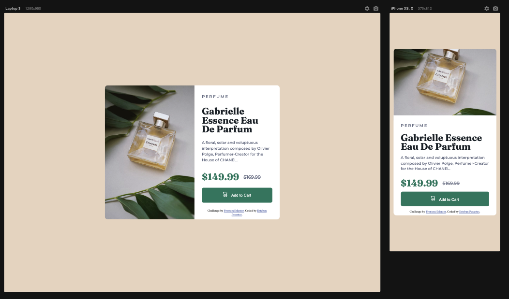

## Table of contents

- [Overview](#overview)
  - [The challenge](#the-challenge)
  - [Screenshot](#screenshot)
  - [Links](#links)
- [My process](#my-process)
  - [Built with](#built-with)
  - [What I learned](#what-i-learned)
- [Author](#author)

## Overview

### The challenge

Users should be able to:

- View the optimal layout depending on their device's screen size
- See hover and focus states for interactive elements. Only the button for this project.

### Screenshot

### Links

- Live Site URL: (https://meek-axolotl-9497c1.netlify.app/)

## My process

### Built with

- Semantic HTML5 markup
- CSS custom properties
- Flexbox

### What I learned

Through this project I was able to get additional practice with media queries - a concept I understand but need to get better at.

## Author

- Frontend Mentor - [@estebanp2022](https://www.frontendmentor.io/profile/estebanp2022)
